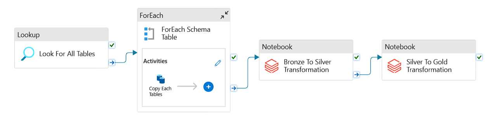
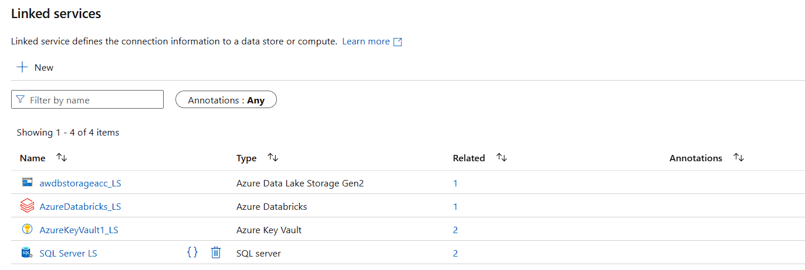

# AZURE DATA FACTORY

  

  

    
1. **LOOKUP ACTIVITY:**

  

  

  

2. **FOR-EACH ACTIVITY:**

  

  

- **COPY ACTIVITY:**

  

  

  

  

  

  

  

3. **NOTEBOOK ACTIVITY(LEVEL1):**

  

4. **NOTEBOOK ACTIVITY(LEVEL2):**

  

