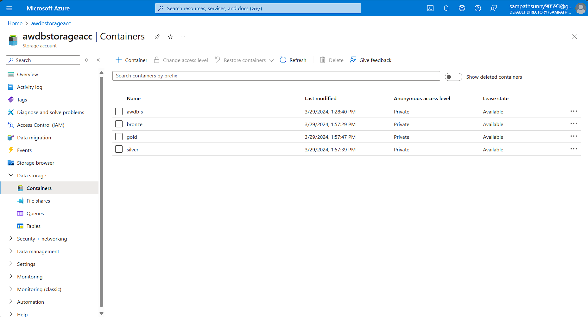

## ADLS Gen2

As this project follows **Medallian Architecture**, Initailly three containers named *broze*, *silver*, *gold* have been created and their significance is mentioned below.
- *Bronze* : Extracted raw data is directly dumped into this container without it being modified or alterd.
- *Silver* : Cleaned and Cleansed raw data will be stored in this container. Cleaning and Cleansing inlcudes removal of *Null* values, outliers, type conversions and transformation of data.
- *Gold* : This container contains the Data which will be filtered, de-normalized accordingly to the bussiness logic.

You can also see a container named *awdbfs* which is created to initialize a mount point to the databricks workspace. Ignore it for now.
