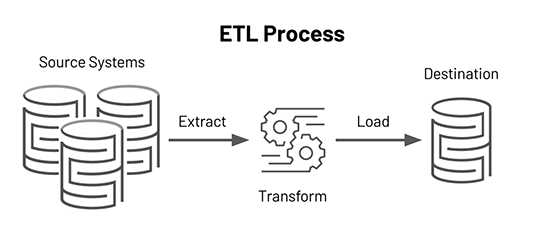
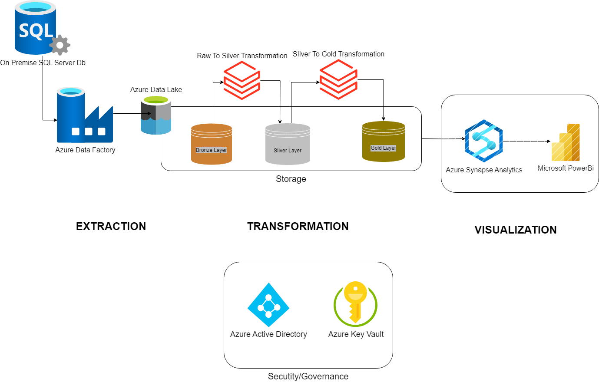
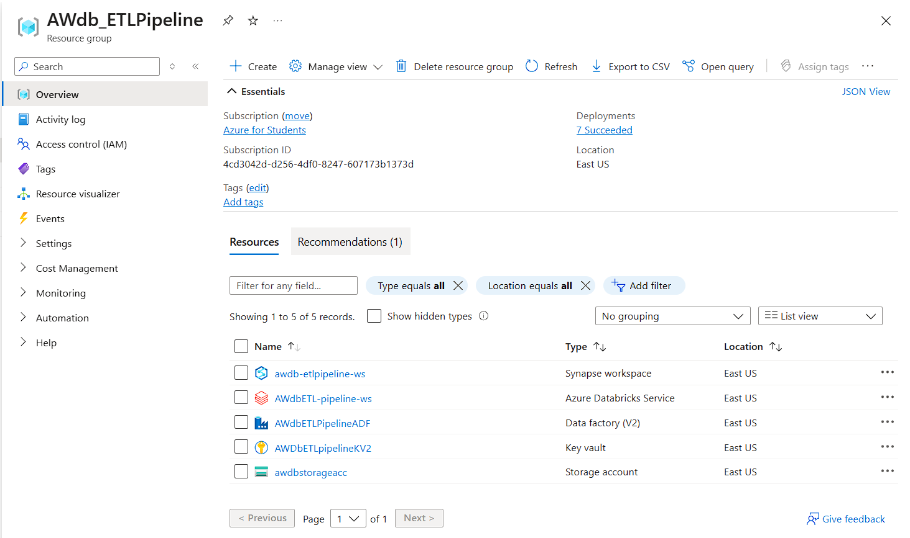

# Database_Migration: Azure_ETL_Pipeline

1. **[AIM](#Aim)**
2. **[AZURE SERVICES](#Azure-Services-Used)**
3. **[PROJECT COMPONENTS](#Project-Components)**
4. **[PROJECT ARCHITECTURE](#Project-Architecture)**
5. **[IN-DETAILED README FILES](#IN-DETAILED-README-FILES)**
   - <a href="Azure Data Lake Gen2/ADLS-README.md">AZURE DATALAKE GEN2 (README)</a>
   - <a href="Azure Data Factory/ADF-README.md">AZURE FACTORY (README)</a>
## Aim:
The primary goal is to design and implement a scalable ETL pipeline that extracts data from an on-premise SQL Server database representing Adventure Works, transforms it into a suitable format for analysis, and loads it into Azure Synapse Analytics Warehouse for further processing and visualization.

## Azure Services Used:
1. Azure Data Lake Gen2:
2. Azure Data Factory:
3. Azure Databricks:
4. Azure Synapse Analystics:
5. Azure Key Vault:

## Project Components:

  

- **Data Extraction:**  
  Source Database (On-Premise SQL Server): Data is extracted from the existing AdventureWorks database hosted on an on-premise SQL Server. The data includes only the tables with *SalesLT* schema.  
- **Data Transformation:**  
   Performing data cleansing, and Implementing transformations to convert raw data into formats suitable for analytical processing using pyspark in Azure Databricks.  
- **Data Loading:**  
  Azure Data Lake Storage: Transformed data is loaded into Azure Data Lake Storage for secure and scalable storage.  
  Azure Synapse Data Lakehouse: Alternatively, the transformed data can be stored in Azure Synapse Data Lakehouse as *Views* to analyze and extract insights and generate reports, visualizations down the line.

## Project Architecture:

  

- **EXTRACTION:**
  - In the extraction phase we have Azure Data Factory (ADF) copying the tables of *SalesLT* schema from On-premise Sql Server into an Azure
  Storage which could be an Azure Data Lake or Azure Blob Storage. Here we have Azure Datalake Gen2.  
  - Even though Azure Databricks could hit the SQL Server database directly, we’re not doing it because we want to leverage the power of Databricks for
  transformation and not extraction.  

- **TRANSFORMATION:**
  - In the transform phase we have Databricks loading the file from a mount point into a dataframe,
  performing transformations and finally writing to a delta store. The following are some of
  highlights of the work done.  
  - With the combination of Azure Datalake and Azure Databricks, we can create a lakehouse
  architecture that follows three layer of data processing:  
  1. Bronze Layer - This is the exact copy of the data source, in its raw form. All the tables
  (relational model) or any unstructured data (Non-relational model) is stored in this layer.
  No transformations are done.  
  2. Silver Layer - In this step, soft data transformations are performed such as fixing data
  types, column names, date formats, etc. to a standardized format and store in a more
  structured way.  
  3. Gold Layer - This layer is the cleanest form of data that can be used for downstream
  tasks. Number of other things could also be implemented at this stage like business rules,
  conformity checks, etc.  

- **LOAD & VISUALIZATION:**
  - In this phase Transformed data from gold layer gets loaded onto Azure Syanpse Analytics Lakehouse as *Views* for further analysis. 
  - PowerBI a powerful visualization tool can be connected Azure Synapse Analytics data warehouse which was created earlier to directly query the data and to create responsive as well as interactive reports.

  

Resouce Group containing all the Resources.

## IN-DETAILED README FILES:
The Project is demonstrated using individual README file of each service. You can find each In-Detailed README files below or in the respective folders in this repository. 
- [Azure DataLake Gen2 (README.md)](https://github.com/BSrinivasChandra/DatabaseToWarehouse_Migration_Azure_Pipeline/blob/2cf9fc7a84aaee7aa0c5de08c335e5a98d8f2431/Azure%20Data%20Lake%20Gen2/ADLS.md)
- [Azure Data Factory (README.md)](https://github.com/BSrinivasChandra/DatabaseToWarehouse_Migration_Azure_Pipeline/blob/b39c9c02226b834c5487572ddca18e94742caa1c/Azure%20Data%20Factory/ADF.md)
