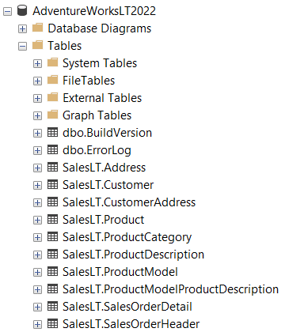

##  On-Premise Sql Server Database (Adventure_Works_Db)

  

Adventure Works Databse (SSMS)
 

  

ER Diagram of Adventure Works Database

## Data Dictionary:
1. **SalesLT.Address** - This table contains information geographic location, demographic information such as AddressID, City, Region.
2. **SalesLT.Customer** - This table contains information about customers, including customer ID, name, PhoneNo.
3. **SalesLT.CustomerAddress** - It contains Customers Address with CustomerID, AddressID.
4. **SalesLT.Product** - It has the information about the product such as ProductID, Product Name, Product Model, Color.
5. **SalesLT.ProductCategory** - This table has information of products category such as ProductCategoryID, ParentProduct.
6. **SalesLT.PrductDescription** - Conatains Description of each product such as Description, ProductDescriptionID.
7. **SalesLT.ProductModel** - Conatains information about product model such as ModelName, ProductModelID.
8. **SlaesLT.ProductModelProductDescription** - Conatains description about product model such as ProductModelID, ProductDescriptionID.
9. **SalesLT.SalesOrderDetail** - This table contains detailed information about sales orders, including order ID, product ID, quantity, unit price, and discount.
10. **SalesLT.SalesOrderHeader** - This table contains header information for purchase orders, including order ID, order date, vendor ID, and shipping information.
